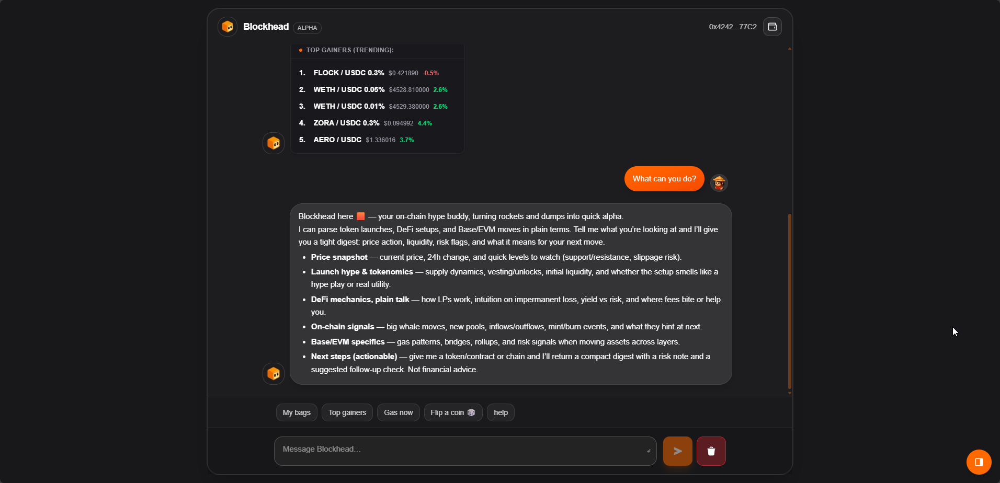
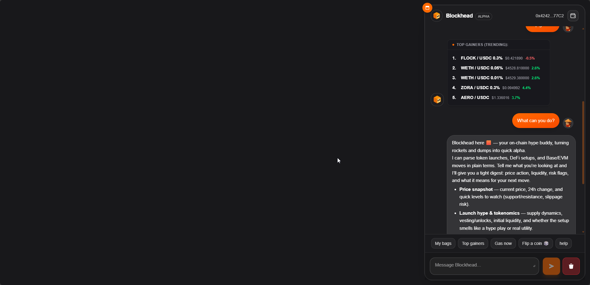
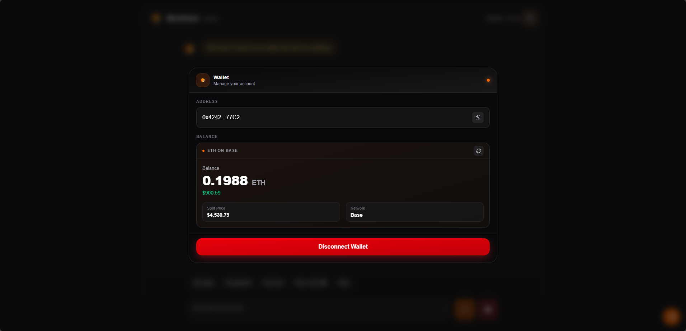
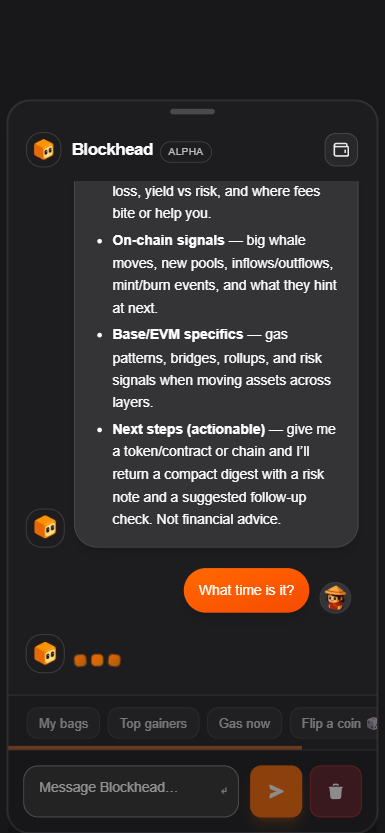

<div align="center">

# Blockhead — On‑chain chat copilot

Compact, fast, and clean chat UI for on‑chain alpha: trending pairs, gas, wallet glance, and quick prompts — powered by a tiny Next.js app and a streaming AI endpoint.

<p>
  <a href="https://img.shields.io/badge/Next.js-15-black?logo=nextdotjs"></a>
  <a href="https://img.shields.io/badge/React-19-61dafb?logo=react"></a>
  <a href="https://img.shields.io/badge/TypeScript-5-3178c6?logo=typescript"></a>
  <a href="./LICENSE"></a>
  <a href="https://img.shields.io/badge/PRs-welcome-brightgreen"></a>
  
</p>

<br/>


<br/>

<br/>

<br/>


</div>

## Demo in 20 seconds

```bash
git clone <your-fork-or-this-repo>.git blockhead && cd blockhead
npm i
echo OPENAI_API_KEY=sk-... > .env.local
npm run dev
# open http://localhost:3000
```

## What this is

- A minimal Next.js 15 app using the App Router.
- A polished chat surface with animated docking on desktop and a bottom‑sheet on mobile.
- Wallet glance modal (Base) with on‑chain balance and Chainlink ETH/USD price.
- Local commands for quick utility: “My bags”, “Top gainers”, “Gas now”, “Flip a coin”, “help”.
- Streaming AI replies via a simple `/api/ai` route (OpenAI‑compatible provider).

## How it works

- `src/components/ai-terminal/AiTerminal.tsx` renders the chat surface, handles streaming, and mobile/desktop layouts.
- `src/app/api/ai/route.ts` proxies prompts to your AI provider with graceful fallbacks.
- `src/lib/*` contains helpers for gas, GeckoTerminal trending, wallet balance, and UI parsing.
- `src/components/WalletMenu.tsx` shows the wallet modal with on‑chain data.

## Getting started

1) Install and run

```bash
npm i
npm run dev
```

2) Environment

Create `.env.local` with:

```bash
OPENAI_API_KEY=sk-...
# Optional if using a router provider
AI_API_BASE_URL=https://openrouter.ai/api/v1
AI_MODEL_NAME=gpt-5-nano
NEXT_PUBLIC_PRIVY_APP_ID= # optional; if empty, the UI still renders without auth
```

3) Open the app at `http://localhost:3000`.

## Commands you can type

- `My bags` — wallet summary card for connected address (Base).
- `Top gainers` — GeckoTerminal trending pools snapshot.
- `Gas now` — Base gas suggestions formatted for quick sending.
- `Flip a coin 🎲` — have fun.
- `help` — list commands.

## Tech

- Next.js 15 App Router, React 19, TypeScript
- framer‑motion for subtle motion (dock/bottom‑sheet)
- react‑markdown + highlight.js for rich replies
- viem for on‑chain reads
- Tailwind v4 (inline theme) for styling

## License

MIT — see `LICENSE`.
